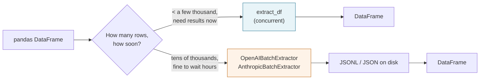
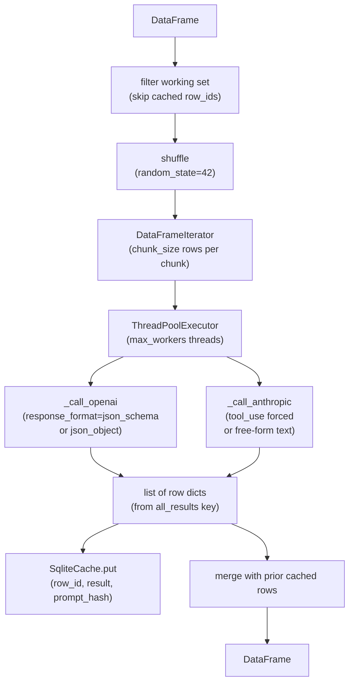
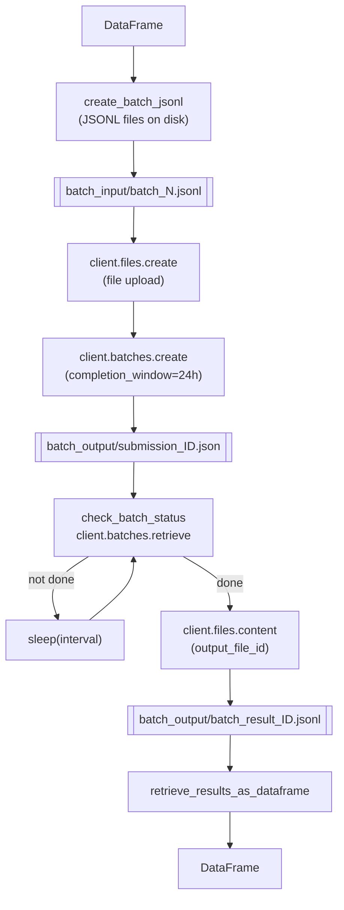
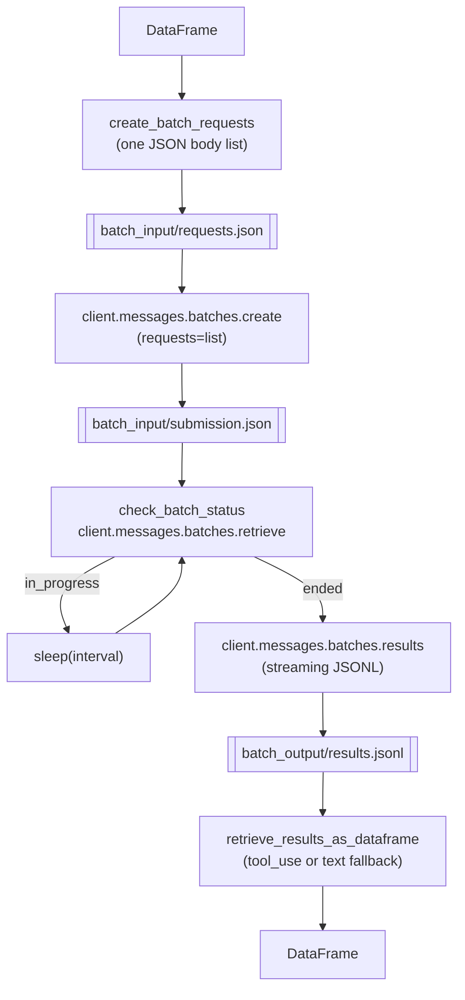

# Architecture

`lmsyz_genai_ie_rfs` has two execution paths. Pick based on how many rows you have and how soon you need results.

---

## The two paths at a glance



**Concurrent path (`extract_df`)**: a threadpool fires live API calls in parallel. A 20-row job finishes in seconds. Rows are written to SQLite as they complete, so a crash loses nothing. This is what you want 95% of the time.

**Batch path (`OpenAIBatchExtractor`, `AnthropicBatchExtractor`)**: submit a request blob (JSONL for OpenAI, JSON body for Anthropic), wait up to 24 hours, retrieve. About 50% cheaper per token. Use when you have tens of thousands of rows and can schedule overnight processing.

---

## Concurrent path internals



Key behaviors:

- **Chunking.** `DataFrameIterator` slices the working DataFrame into lists of `{"input_id": ..., "input_text": ...}` dicts, `chunk_size` rows at a time. Each chunk is one API call.
- **Shuffle.** Before chunking, `extract_df` shuffles the working rows (fixed `random_state=42`). This distributes variable-length inputs more evenly across workers.
- **ThreadPoolExecutor.** All chunks are submitted at once via `concurrent.futures.as_completed`. Progress is shown with `tqdm`.
- **Retries.** Each call function is decorated with `@retry_api_call` (tenacity, 5 attempts, exponential backoff 2-30 s) for `RateLimitError` and `APIError`. Retries happen at the individual chunk level.
- **Per-chunk error handling.** If a chunk exhausts all retries, `extract_df` logs the exception via `log.exception` and skips that chunk. The other chunks' results are still returned. The returned DataFrame will have fewer rows than the input; check the log.
- **Cache write.** Each successful row is written to `SqliteCache` immediately after the chunk returns, before the next chunk finishes. A crash mid-run loses at most one chunk's work.
- **Cache read.** At startup, `extract_df` reads the set of already-cached row IDs (filtered by `prompt_hash`) and removes them from the working set.

---

## Batch path internals

The two batch classes share a four-step lifecycle but have different wire formats.

### OpenAI batch



Steps:
1. `create_batch_jsonl` builds one or more JSONL files under `batch_input/`. Each line is a request dict with a `custom_id`, an HTTP method, the `/v1/chat/completions` endpoint, and a full request body. Files are capped at `max_requests_per_batch` requests (default 5,000).
2. `submit_batches` uploads each JSONL file via `client.files.create(purpose="batch")` and then calls `client.batches.create`. A submission manifest is written to `batch_output/submission_<batch_id>.json`.
3. `check_batch_status` polls `client.batches.retrieve`. When complete, the output file is downloaded and written to `batch_output/batch_result_<batch_id>.jsonl`. Errors are written to `batch_output/batch_error_<batch_id>.txt`.
4. `retrieve_results_as_dataframe` parses each result JSONL, extracts the `all_results` list from each response, and returns a DataFrame.

### Anthropic batch



Key differences from OpenAI:

| | OpenAI | Anthropic |
|---|---|---|
| Input format | JSONL files on disk, one line per request | Single JSON body: a list of request dicts |
| File upload step | Yes: `client.files.create` | No: requests posted directly in the API call |
| Result delivery | Download via output file ID | Streamed via `client.messages.batches.results` |
| Max per batch | 5 GB output / 200 MB input | 100,000 requests or 256 MB, whichever first |
| Result retention | Not specified | 29 days |

Both classes write every intermediate artifact (requests, manifests, raw results) to disk under `batch_root_dir/job_id/`. Nothing is hidden; you can inspect exactly what was sent and what came back.

---

## Module layout

```
src/lmsyz_genai_ie_rfs/
├── client.py            extract_df, _call_openai, _call_anthropic
├── batch.py             OpenAIBatchExtractor  (JSONL file upload path)
├── anthropic_batch.py   AnthropicBatchExtractor  (JSON body path)
├── dataframe.py         DataFrameIterator, SqliteCache, compute_prompt_hash
├── retry.py             retry_api_call  (tenacity decorator)
└── settings.py          Settings  (pydantic-settings, reads .env / environment)
```

- **`client.py`** is the main entry point for the concurrent path. It owns the public `extract_df` function and the two private call helpers.
- **`batch.py`** and **`anthropic_batch.py`** are independent batch path implementations. They share `DataFrameIterator` from `dataframe.py` but otherwise do not share code.
- **`dataframe.py`** contains the chunking logic (`DataFrameIterator`), the cache (`SqliteCache`), and the hash function (`compute_prompt_hash`). Both paths import from here.
- **`retry.py`** exports one decorator: `@retry_api_call`. It is applied to `_call_openai` and `_call_anthropic` at definition time.
- **`settings.py`** reads `OPENAI_API_KEY`, `ANTHROPIC_API_KEY`, and `OPENAI_BASE_URL` from the environment or a `.env` file via `pydantic-settings`.

---

## What this library does NOT do

- **No ORM or schema mapping.** Results land in a DataFrame as plain dicts. No model classes are generated or required.
- **No circuit breakers.** Retry logic is tenacity-only: 5 attempts, exponential backoff, then the chunk is skipped and logged. There is no half-open state or global failure threshold.
- **No in-flight monitoring UI.** Progress is `tqdm` on the terminal. For batch jobs, progress is log lines from `check_batch_status`.
- **No auto-tuning.** `chunk_size` and `max_workers` are caller-supplied. The library does not observe latency or rate-limit headers and adjust automatically.
- **No streaming responses.** Each chunk call is a single blocking request; the library does not use streaming completions.
