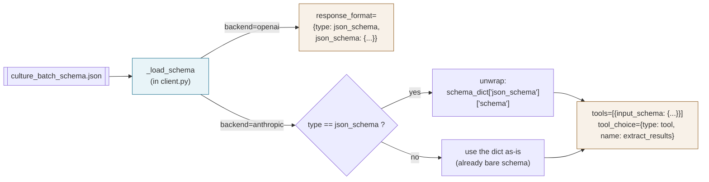

# Prompts and schemas

The prompt is the schema. The model returns whatever the prompt described. No Python classes to define, no field mappings to maintain. This page explains how that works in practice, when to add an optional JSON schema file, and how the library handles the differences between OpenAI and Anthropic.

---

## The prompt is the schema (usually)

When you call `extract_df` without a `schema=` argument, the only thing that defines the output shape is the text of your prompt. The model reads it, follows the instructions, and returns a JSON object.

Here is the exact prompt used in `tests/data/culture_extraction_prompt.txt`:

```
You are a corporate culture analyst. For each input row (analyst report segment), classify the corporate culture described and determine its tone. Return a structured JSON object.

For each row:

1. input_id: Copy the input_id from the row verbatim.

2. culture_type: Assign exactly one of these six categories:
   - collaboration_people: teamwork, employee well-being, diversity, inclusion, communication, empowerment.
   - customer_oriented: customer service, satisfaction, retention, experience, client focus, product or service quality.
   - innovation_adaptability: creativity, experimentation, agility, disruption, willingness to change, fast-moving.
   - integrity_risk: ethics, transparency, accountability, compliance, risk management, financial prudence.
   - performance_oriented: high expectations, execution speed, achievement, results, operational efficiency, competitiveness.
   - miscellaneous: generic or non-specific cultural statements that do not cleanly fit the above.

3. tone: One of "positive", "neutral", or "negative". Reflects the analyst's attitude toward the culture described, not whether the culture itself is desirable. If unclear, use "neutral".

4. confidence: Your self-assessed confidence in the classification, a float in [0.0, 1.0].

Return a JSON object with key "all_results" whose value is a list of objects, one per input row, each with fields: input_id, culture_type, tone, confidence.
```

Two things to notice:

1. The prompt asks for a JSON object with key `all_results`. That key is the convention the library expects when parsing responses. `_call_openai` and `_call_anthropic` both look for `all_results` (falling back to `results`) to extract the per-row list.
2. Every field the model should return is described in plain English. There are no Python classes or JSON schema files involved.

---

## Chunking: what the model actually sees

`extract_df` does not send rows one at a time. It sends groups of rows per API call. The `chunk_size` parameter (default 5) controls the group size.

`DataFrameIterator` converts each chunk into a list of dicts:

```python
[
    {"input_id": "101", "input_text": "The team is empowered to innovate..."},
    {"input_id": "102", "input_text": "Management prioritizes quarterly returns..."},
    {"input_id": "103", "input_text": "Customer satisfaction is the north star..."},
    {"input_id": "104", "input_text": "Strict compliance training for all staff..."},
    {"input_id": "105", "input_text": "We move fast and break things."},
]
```

This list is serialized as JSON and sent as the user message. The system prompt stays constant across all chunks. So for a 100-row DataFrame with `chunk_size=5`, there are 20 API calls, each with the same system prompt and 5 rows in the user message.

**Chunk size trade-offs:**

- Smaller chunks (3-5) parallelize better, have a smaller blast radius if a chunk fails, and are easier to retry within budget.
- Larger chunks (10-20) amortize the system prompt better, especially relevant for Anthropic's prompt caching (see below). They also reduce the number of API calls, which matters at very high request volumes.
- Start at 5. Adjust up if you are paying for a large system prompt on Anthropic and want to maximize cache hits.

---

## Optional: a JSON schema file

The prompt-only path is the default because it works on both providers without any extra setup and covers most research use cases. When you want the provider itself to enforce the output shape (so a malformed row raises a structured error instead of slipping through as a misparse), pass a JSON schema file.

The file is a standard OpenAI `response_format` object. Here is the full contents of `tests/data/culture_batch_schema.json`:

```json
{
  "type": "json_schema",
  "json_schema": {
    "name": "culture_batch",
    "strict": true,
    "schema": {
      "type": "object",
      "additionalProperties": false,
      "required": ["all_results"],
      "properties": {
        "all_results": {
          "type": "array",
          "items": {
            "type": "object",
            "additionalProperties": false,
            "required": ["input_id", "culture_type", "tone", "confidence"],
            "properties": {
              "input_id": {"type": "string"},
              "culture_type": {
                "type": "string",
                "enum": [
                  "collaboration_people",
                  "customer_oriented",
                  "innovation_adaptability",
                  "integrity_risk",
                  "performance_oriented",
                  "miscellaneous"
                ]
              },
              "tone": {
                "type": "string",
                "enum": ["positive", "neutral", "negative"]
              },
              "confidence": {"type": "number", "minimum": 0.0, "maximum": 1.0}
            }
          }
        }
      }
    }
  }
}
```

Key things about the schema format:

- `"strict": true` tells OpenAI to reject any response that does not conform exactly. This requires `additionalProperties: false` on every object and every field listed in `required`.
- `additionalProperties: false` means the model cannot return fields you did not declare. Strict mode will not validate without it.
- `enum` narrows a string field to a fixed set of values. This is the most effective way to prevent the model from inventing category names.
- Every property must appear in the `required` array when `strict: true` is in effect.

Pass the schema as a file path:

```python
from lmsyz_genai_ie_rfs import extract_df

out = extract_df(
    df,
    prompt=my_prompt,
    schema="tests/data/culture_batch_schema.json",   # path to the file
    backend="openai",
    model="gpt-4.1-mini",
    cache_path="runs/structured.sqlite",
)
```

Or as a dict (the same JSON, loaded in Python):

```python
import json

schema = json.loads(open("culture_batch_schema.json").read())
out = extract_df(
    df,
    prompt=my_prompt,
    schema=schema,
    backend="openai",
    model="gpt-4.1-mini",
    cache_path="runs/structured.sqlite",
)
```

Or pass `None` (the default) to skip schema enforcement entirely.

---

## Same file, both providers

One schema file works for both OpenAI and Anthropic. The library handles the translation internally.



The translation happens in `extract_df` in `client.py`:

```python
if backend == "openai":
    call_args = {"response_format": schema_dict}   # pass through unchanged
else:
    # Anthropic uses the inner schema as a tool's input_schema.
    if schema_dict.get("type") == "json_schema" and "json_schema" in schema_dict:
        input_schema = schema_dict["json_schema"]["schema"]   # unwrap
    else:
        input_schema = schema_dict   # already the inner schema
    call_args = {"input_schema": input_schema}
```

For OpenAI, the full wrapper dict is passed directly as `response_format`. For Anthropic, the library unwraps the inner `schema` and passes it as the `input_schema` of a forced `tool_use` tool named `extract_results`. The model is required to call that tool (via `tool_choice={"type": "tool", "name": "extract_results"}`), so the response always contains a `tool_use` block.

---

## Provider differences in prompt caching

Repeated calls with the same long system prompt benefit from caching at the provider level. The mechanics differ:

**OpenAI:** caches automatically for prompts of 1,024 or more tokens. No extra code needed. Cached tokens are billed at a reduced rate.

**Anthropic:** caching is explicit. The library sets `cache_control={"type": "ephemeral"}` on the system block in every call to `_call_anthropic`:

```python
system_block = [
    {"type": "text", "text": system_prompt, "cache_control": {"type": "ephemeral"}}
]
```

This happens automatically. You do not need to configure anything. The same block is used in `AnthropicBatchExtractor.create_batch_requests` for batch jobs.

**Practical consequence for chunk size:** with Anthropic caching, the system prompt is billed at full price only on the first chunk that establishes the cache. Subsequent chunks pay the cached token rate. Larger `chunk_size` means fewer chunks, but the system prompt cost per call is the same (just the user message scales). The cache hit rate is high regardless of chunk size, as long as the prompt stays constant across the run.

---

## Tips for prompt writing in this framework

**Always ask for `all_results`.** Every response parser in the library (`_call_openai`, `_call_anthropic`, `retrieve_results_as_dataframe`) looks for `all_results` first, then falls back to `results`. Use `all_results` in your prompt to stay on the happy path:

```
Return a JSON object with key "all_results" whose value is a list of objects, one per input row.
```

**For Anthropic without a schema, be explicit about the format.** When `schema=None`, Anthropic returns free-form text. The library strips ``` fences and finds the outermost `{}`, but it cannot fix a response that is not JSON at all. Add this line to the prompt:

```
Respond with ONLY a JSON object, no preamble, no markdown fences.
```

**Include `input_id: Copy verbatim`.** This is critical. The library matches result rows back to input rows by `input_id`. If the model rephrases or omits the ID, the row will be lost. Instruct the model explicitly to copy it unchanged.

**Keep examples brief.** A few-shot example in the system prompt is billed on every chunk. At 20 max workers and 5 rows per chunk, a 500-token example adds 10,000 tokens per 100 rows. Use examples only when zero-shot performance is genuinely poor.

**Describe the fields before the format.** The model follows field-by-field instructions more reliably than a raw schema listing. The example prompt above lists each field with a number and a description before stating the final JSON format. This pattern works better than starting with the JSON shape.
