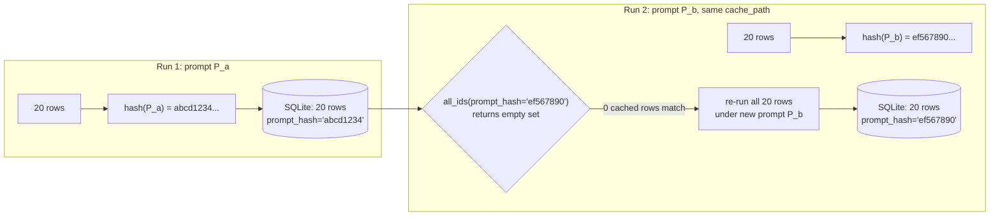

# Results database

Every completed row is written to a SQLite file as it finishes. This page explains how that works, why `cache_path` is required, and how prompt-hash gating ensures you never silently reuse stale results.

---

## `cache_path` is required

`extract_df` requires `cache_path`. It is a keyword-only argument with no default:

```python
out = extract_df(
    df,
    prompt=my_prompt,
    backend="openai",
    model="gpt-4.1-mini",
    cache_path="runs/my_experiment.sqlite",   # required
)
```

Omitting it raises:

```
TypeError: extract_df() missing 1 required keyword-only argument: 'cache_path'
```

This mirrors the original `gpt_funcs.py:run_gpt_on_df` where the equivalent `db_path` argument was also required. The design choice is deliberate: the cost of a two-hour, 100k-row run that crashes at 80% is high enough that there should be no way to accidentally skip persistence. A forgotten keyword argument should be loud, not silent.

The file is a standard SQLite database. Open it in any SQLite browser, with the `sqlite3` CLI, or with `sqlite3` in Python:

```python
import sqlite3, json

con = sqlite3.connect("runs/my_experiment.sqlite")
rows = con.execute("SELECT row_id, prompt_hash, json_result FROM results LIMIT 5").fetchall()
for row_id, phash, result_json in rows:
    print(row_id, phash, json.loads(result_json))
```

---

## Schema

The database has a single table:

```sql
CREATE TABLE IF NOT EXISTS results (
    row_id      TEXT PRIMARY KEY,
    json_result TEXT NOT NULL,
    prompt_hash TEXT
);
```

Column descriptions:

- **`row_id`**: The string representation of the identifier from `id_col` in the input DataFrame. Primary key. Uniquely identifies each input row in the cache.
- **`json_result`**: The full result dict for this row, serialized as JSON. This is whatever the model returned for this input row (e.g., `{"input_id": "42", "culture_type": "innovation_adaptability", "tone": "positive", "confidence": 0.92}`).
- **`prompt_hash`**: The first 16 hex characters of the SHA-256 hash of the prompt that produced this result. Used to detect when the prompt has changed since this row was cached. Can be NULL for rows written by older versions of the library (see migration below).

Writes use `INSERT OR REPLACE`, which is SQLite's upsert: if a row with the same `row_id` already exists, it is overwritten. This means re-running with `fresh=True` or with a changed prompt writes new results over old ones in place.

---

## Resume semantics

If a run is interrupted (crash, keyboard interrupt, rate limit exhaustion), the rows that completed are already on disk. Rerunning the same call resumes from where it stopped.

```mermaid
flowchart TB
    subgraph run1 ["Run 1: interrupted at row 600 / 1000"]
        START1[1000 rows] --> CALL1["extract_df processes rows 1-600\nbefore crash"]
        CALL1 --> CACHE1[(SQLite: 600 rows written)]
    end
    subgraph run2 ["Run 2: same cache_path, same prompt"]
        START2[1000 rows] --> READ["SqliteCache.all_ids\n(prompt_hash=current hash)"]
        READ --> FILTER["filter: remove 600 cached row_ids\nworking set = 400 rows"]
        FILTER --> CALL2["extract_df processes 400 rows"]
        CALL2 --> CACHE2[(SQLite: 1000 rows total)]
        CACHE2 --> MERGE["merge: 400 new + 600 cached"]
        MERGE --> OUT[DataFrame: 1000 rows]
    end
```



After run 2, the returned DataFrame contains all 1,000 rows: the 400 freshly processed and the 600 retrieved from cache. The caller gets a complete result set without re-spending tokens on rows that already completed.

---

## Prompt-hash gating

### How it works

`compute_prompt_hash` in `dataframe.py` returns the first 16 hex characters of the SHA-256 digest of the prompt string:

```python
def compute_prompt_hash(prompt: str) -> str:
    return hashlib.sha256(prompt.encode("utf-8")).hexdigest()[:16]
```

SHA-256 is stable across Python versions and machines (unlike `hash()`). A 16-char prefix gives 64 bits of collision resistance, which is more than enough for distinguishing prompt versions.

Every time `extract_df` runs, it computes this hash and:
1. Passes it to `SqliteCache.all_ids(prompt_hash=phash)` to find which rows were already cached under this exact prompt.
2. Passes it to `SqliteCache.put(row_id, result, prompt_hash=phash)` when writing new results.

### What happens when you change the prompt



Changing the prompt means new results are expected. The old rows (written under `abcd1234`) are not returned; they are simply ignored because their hash does not match. The new results are written under `ef567890`. Both sets of rows coexist in the database (since `row_id` is the primary key, and the old rows are not deleted unless you overwrite them).

### The escape hatch: `ignore_prompt_hash=True`

Sometimes a prompt edit is non-semantic: fixing a typo, rewording a sentence without changing the task, renaming a section heading. In that case, you do not want to re-spend tokens. Pass `ignore_prompt_hash=True`:

```python
out = extract_df(
    df,
    prompt=prompt_v2,
    cache_path="runs/cache.sqlite",
    ignore_prompt_hash=True,   # reuse rows from any prior prompt
    backend="openai",
    model="gpt-4.1-mini",
)
```

With `ignore_prompt_hash=True`, `extract_df` calls `SqliteCache.all_ids(prompt_hash=None)`, which returns all cached row IDs regardless of hash. It will reuse whatever is there.

---

## Legacy cache migration

Older caches created before the `prompt_hash` column existed still work. On first open, `SqliteCache.__init__` runs:

```python
try:
    con.execute("ALTER TABLE results ADD COLUMN prompt_hash TEXT")
except sqlite3.OperationalError:
    pass  # column already exists
```

This adds the column if it is missing. Existing rows get `NULL` for `prompt_hash`. When `extract_df` runs with a hash-aware lookup, those `NULL` rows do not match any specific prompt hash, so the library treats them as un-cached and re-runs them. This is conservative: better to re-run a row than to return a stale result from an unknown prior prompt.

If you want to keep the old results and skip re-running, pass `ignore_prompt_hash=True` on the first run after migration.

---

## Inspecting the database

You can query the database directly at any time:

```bash
sqlite3 runs/my_experiment.sqlite \
  "SELECT row_id, prompt_hash, json_result FROM results LIMIT 10;"
```

Or in Python:

```python
import sqlite3, json, pandas as pd

con = sqlite3.connect("runs/my_experiment.sqlite")
df = pd.read_sql("SELECT * FROM results", con)
df["parsed"] = df["json_result"].apply(json.loads)
print(df[["row_id", "prompt_hash"]].head())
```

For more query patterns, see the how-to page [Inspect the results database](../how-to/inspect-results-db.md).
