# Resume after a crash

## Problem

Your 100k-row extraction job crashed halfway through. You do not want to re-process the
rows that already completed, because that wastes tokens and money.

## Solution

Pass the same `cache_path=` when you rerun. The library reads what is already in the
SQLite file, filters those rows out of the working set, processes only the remainder,
then returns all rows together.

```python
import pandas as pd
from lmsyz_genai_ie_rfs import extract_df

df = pd.read_csv("my_corpus.csv")   # e.g., 100,000 rows with "id" and "text" columns

prompt = """
For each input row, extract:
- input_id: copy verbatim.
- sentiment: "positive", "neutral", or "negative".

Return a JSON object with key "all_results" whose value is the list of per-row objects.
"""

# First run (or a resumed run after a crash):
out = extract_df(
    df,
    prompt=prompt,
    cache_path="runs/extraction.sqlite",   # required: where results are persisted
    model="gpt-4.1-mini",
    backend="openai",
)
out.to_csv("runs/extraction.csv", index=False)
```

If the process is interrupted and you rerun the exact same cell, the library:

1. Opens `runs/extraction.sqlite`.
2. Reads the IDs already stored (filtered by the current prompt hash).
3. Removes those IDs from the working DataFrame.
4. Sends only the remaining rows to the API.
5. Returns all rows, combining newly processed results with the cached ones.

No code change is needed. Just rerun.

### Simulating a crash on 20 rows

```python
import pandas as pd
from lmsyz_genai_ie_rfs import extract_df

# Build a small test DataFrame.
df = pd.DataFrame({
    "id": [f"row_{i:03d}" for i in range(20)],
    "text": [f"Sentence number {i}." for i in range(20)],
})

prompt = """
For each row, copy input_id verbatim and return sentiment as "neutral".
Return {\"all_results\": [...]}.
"""

CACHE = "runs/demo_resume.sqlite"

# --- Run 1: processes all 20 rows ---
out1 = extract_df(df, prompt=prompt, cache_path=CACHE, backend="openai", model="gpt-4.1-mini")
print(f"Run 1 returned {len(out1)} rows")

# --- Run 2: same call, same cache_path ---
# The library skips all 20 cached rows; no API calls are made.
out2 = extract_df(df, prompt=prompt, cache_path=CACHE, backend="openai", model="gpt-4.1-mini")
print(f"Run 2 returned {len(out2)} rows (all from cache)")
```

You will see a log line like:

```
SqliteCache: skipping 20 / 20 rows (prompt_hash=a3f9...).
```

### Inspecting cache contents

You can check how many rows are stored versus how many are in your input DataFrame at any
time without running the full extraction:

```python
import sqlite3
import pandas as pd

CACHE = "runs/extraction.sqlite"
df = pd.read_csv("my_corpus.csv")

with sqlite3.connect(CACHE) as con:
    cached = con.execute("SELECT COUNT(*) FROM results").fetchone()[0]

total = len(df)
print(f"Cached: {cached} / {total}  ({100 * cached / total:.1f}%)")
print(f"Remaining: {total - cached}")
```

Or from the command line:

```bash
sqlite3 runs/extraction.sqlite "SELECT COUNT(*) FROM results;"
```

### The opposite lever: `fresh=True`

If you want to discard the cache and reprocess every row from scratch, pass `fresh=True`:

```python
out = extract_df(
    df,
    prompt=prompt,
    cache_path="runs/extraction.sqlite",
    model="gpt-4.1-mini",
    fresh=True,   # ignore existing cache; reprocess everything
)
```

This is useful when you have changed the model, or when you want a clean comparison
against a prior run. The old rows in the SQLite file are overwritten as new results come
in.

## Explanation

`cache_path` is required, not optional. The library treats it as the results database for
the job. Every row is written to the file the moment it completes, so partial progress is
never lost. The file is a plain SQLite database; you can open it in any SQLite browser,
`DB Browser for SQLite`, or from Python with the standard `sqlite3` module.

The two-run lifecycle looks like this:

```mermaid
flowchart TB
    subgraph run1 ["Run 1: interrupted at row 600 / 1000"]
        START1[1000 rows] --> CALL1["extract_df processes rows 1-600\nbefore crash"]
        CALL1 --> CACHE1[(SQLite: 600 rows written)]
    end
    subgraph run2 ["Run 2: same cache_path, same prompt"]
        START2[1000 rows] --> READ["SqliteCache.all_ids\n(prompt_hash=current hash)"]
        READ --> FILTER["filter: remove 600 cached row_ids\nworking set = 400 rows"]
        FILTER --> CALL2["extract_df processes 400 rows"]
        CALL2 --> CACHE2[(SQLite: 1000 rows total)]
        CACHE2 --> MERGE["merge: 400 new + 600 cached"]
        MERGE --> OUT[DataFrame: 1000 rows]
    end
```



After run 2, the returned DataFrame has all 1,000 rows without re-spending tokens on the
600 that already completed.

See [the schema in concepts/results-db.md](../concepts/results-db.md#schema) for the full
DDL. In brief: `row_id` is the primary key (string form of `id_col`), `json_result` is
the model output serialised as JSON, and `prompt_hash` is a 16-character SHA-256 hex
digest of the prompt. See [Change the prompt safely](change-prompt-safely.md) for how
that gating works.

When `extract_df` starts, it calls `SqliteCache.all_ids(prompt_hash=current_hash)` to
get the set of IDs already cached under the current prompt. It removes those rows from
the working DataFrame before building the thread pool. The skipped rows are retrieved
from the cache at the end and merged into the result.

A chunk that fails is logged and its rows are omitted from the output. You will see
`extract_df: chunk failed; results for this chunk skipped.` in the log. Those row IDs
will NOT be in the cache, so the next run will retry them automatically.

## Related

- [Change the prompt safely](change-prompt-safely.md): how prompt hashing prevents
  accidental cache reuse.
- [Inspect the results database](inspect-results-db.md): SQL queries for auditing cache
  contents, finding missing rows, and loading the cache into a DataFrame.
- [Reference: `extract_df`](../reference/extract_df.md)
- [Concepts: results database](../concepts/results-db.md)
